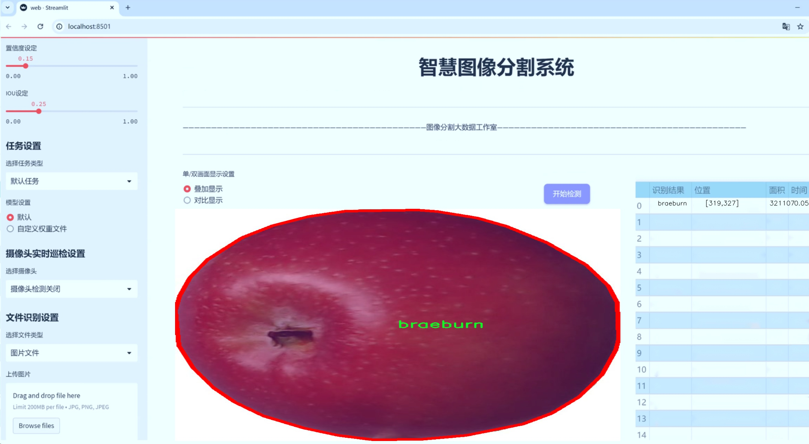
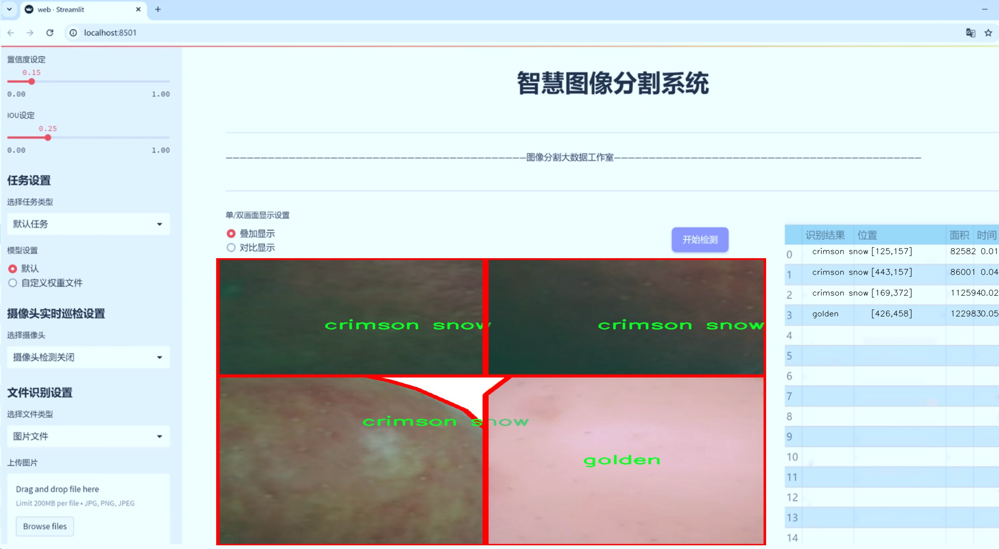
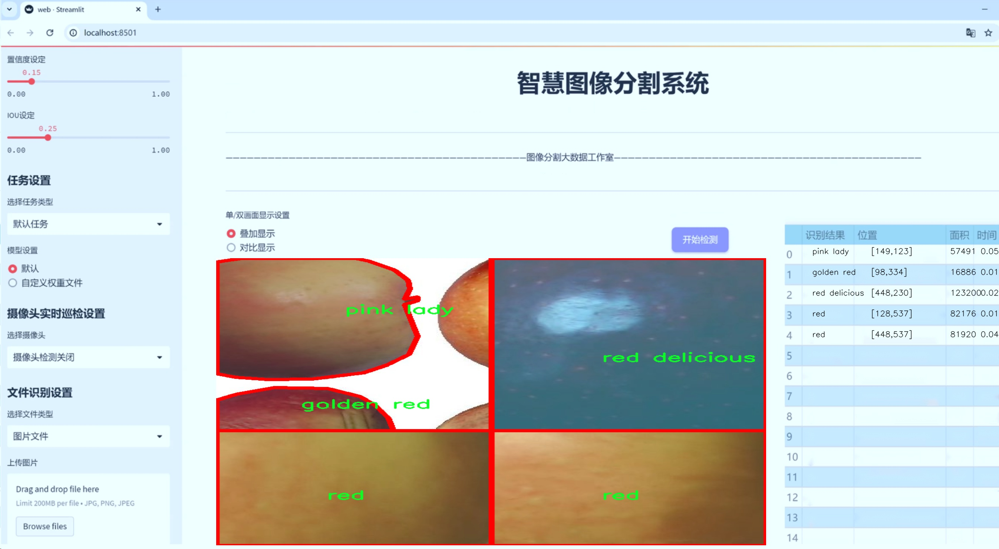
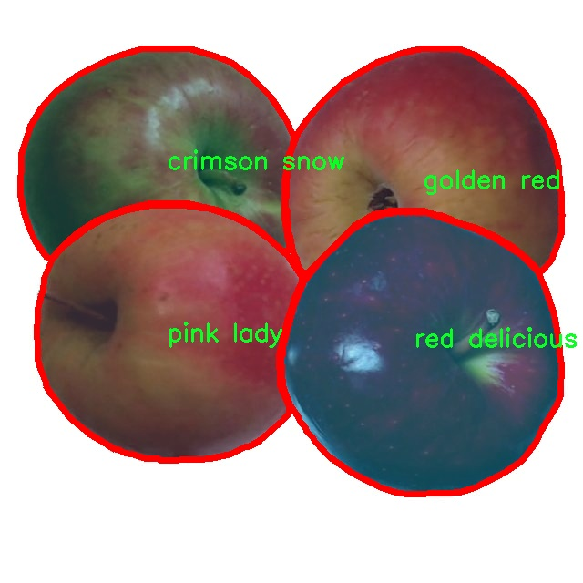
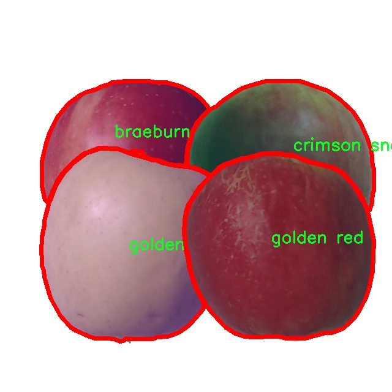
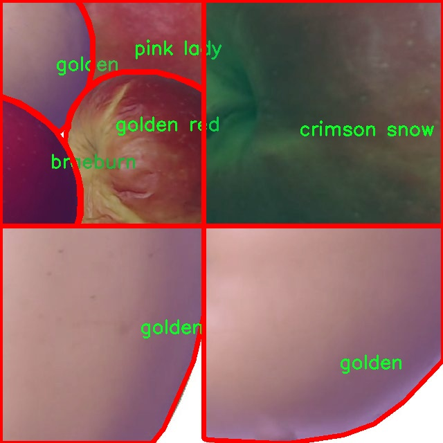
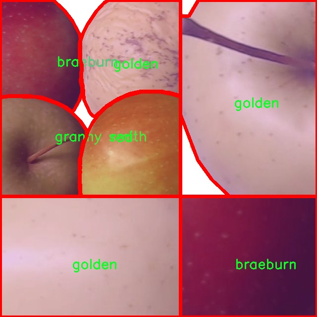
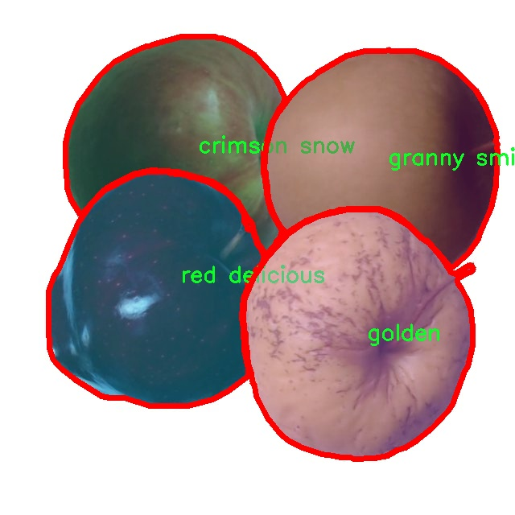

# 苹果品种分割系统源码＆数据集分享
 [yolov8-seg-C2f-RFCAConv＆yolov8-seg-C2f-DCNV3等50+全套改进创新点发刊_一键训练教程_Web前端展示]

### 1.研究背景与意义

项目参考[ILSVRC ImageNet Large Scale Visual Recognition Challenge](https://gitee.com/YOLOv8_YOLOv11_Segmentation_Studio/projects)

项目来源[AAAI Global Al lnnovation Contest](https://kdocs.cn/l/cszuIiCKVNis)

研究背景与意义

随着全球人口的不断增长和生活水平的提高，水果作为人们日常饮食中不可或缺的部分，其生产和消费需求日益增加。苹果作为一种广受欢迎的水果，因其丰富的营养价值和多样的品种而备受青睐。苹果的品种繁多，不同品种的苹果在外观、口感、营养成分等方面存在显著差异。因此，如何准确地识别和分割不同品种的苹果，不仅对果农的生产管理、市场营销具有重要意义，也对消费者选择优质水果提供了便利。

在传统的苹果品种识别方法中，人工识别往往效率低下且容易出错，尤其是在面对大规模果园时，人工成本和时间成本都显得尤为突出。随着计算机视觉技术的快速发展，基于深度学习的图像处理方法逐渐成为解决这一问题的有效手段。YOLO（You Only Look Once）系列模型因其实时性和高准确率，广泛应用于目标检测和分割任务中。特别是YOLOv8模型，凭借其在特征提取和模型优化方面的创新，展现出优越的性能，为苹果品种的自动识别与分割提供了新的可能性。

本研究旨在基于改进的YOLOv8模型，构建一个高效的苹果品种分割系统。我们将使用一个包含1900张图像的苹果分割数据集，该数据集涵盖了8种不同的苹果品种，包括Braeburn、Crimson Snow、Golden、Golden Red、Granny Smith、Pink Lady、Red和Red Delicious。这些数据不仅为模型的训练提供了丰富的样本，也为后续的测试和验证奠定了基础。通过对这些不同品种的苹果进行有效的分割与识别，研究将推动苹果种植、采摘及销售环节的智能化进程。

本研究的意义不仅在于提升苹果品种识别的准确性和效率，更在于为农业领域的智能化转型提供实践依据。通过构建高效的苹果品种分割系统，果农可以更好地进行品种管理，及时了解不同品种的生长状况，从而优化种植策略，提升产量和品质。同时，消费者在选购苹果时，也能够通过该系统获得更为直观的信息，帮助他们做出更为科学的选择。此外，该研究还将为其他水果的分割与识别提供借鉴，推动水果产业的智能化发展。

综上所述，基于改进YOLOv8的苹果品种分割系统的研究，不仅具有重要的理论价值，也具备广泛的应用前景。通过深入探索深度学习技术在农业领域的应用，推动农业现代化进程，实现科技与农业的深度融合，最终为实现可持续发展目标贡献力量。

### 2.图片演示







##### 注意：由于此博客编辑较早，上面“2.图片演示”和“3.视频演示”展示的系统图片或者视频可能为老版本，新版本在老版本的基础上升级如下：（实际效果以升级的新版本为准）

  （1）适配了YOLOV8的“目标检测”模型和“实例分割”模型，通过加载相应的权重（.pt）文件即可自适应加载模型。

  （2）支持“图片识别”、“视频识别”、“摄像头实时识别”三种识别模式。

  （3）支持“图片识别”、“视频识别”、“摄像头实时识别”三种识别结果保存导出，解决手动导出（容易卡顿出现爆内存）存在的问题，识别完自动保存结果并导出到tempDir中。

  （4）支持Web前端系统中的标题、背景图等自定义修改，后面提供修改教程。

  另外本项目提供训练的数据集和训练教程,暂不提供权重文件（best.pt）,需要您按照教程进行训练后实现图片演示和Web前端界面演示的效果。

### 3.视频演示

[3.1 视频演示](https://www.bilibili.com/video/BV1pV2pYxEWL/)

### 4.数据集信息展示

##### 4.1 本项目数据集详细数据（类别数＆类别名）

nc: 8
names: ['braeburn', 'crimson snow', 'golden', 'golden red', 'granny smith', 'pink lady', 'red', 'red delicious']


##### 4.2 本项目数据集信息介绍

数据集信息展示

在现代农业科技的快速发展中，苹果品种的自动识别与分割成为了一个重要的研究领域。为此，我们构建了一个名为“Apple Segmentation”的数据集，旨在为改进YOLOv8-seg模型提供高质量的训练数据。该数据集专注于苹果的多样性，涵盖了八种不同的苹果品种，分别是：Braeburn、Crimson Snow、Golden、Golden Red、Granny Smith、Pink Lady、Red和Red Delicious。这些品种不仅在外观上存在显著差异，而且在口感、营养成分及适应环境等方面也各具特色。

“Apple Segmentation”数据集的设计考虑到了苹果的形态特征与生长环境，确保每个品种的样本都能真实反映其在自然状态下的表现。数据集中包含了丰富的图像数据，这些图像来源于不同的生长阶段和环境条件，以便模型能够学习到更为广泛的特征。每个苹果品种的图像都经过精心标注，确保分割的准确性和一致性。这种高质量的标注不仅有助于模型的训练，也为后续的验证和测试提供了可靠的基础。

在类别数量方面，数据集包含了八个独特的类别，每个类别代表一种特定的苹果品种。这种多样性使得模型在训练过程中能够接触到丰富的特征，进而提高其在实际应用中的泛化能力。例如，Braeburn苹果以其独特的色泽和纹理而闻名，而Crimson Snow则以其鲜艳的红色和光滑的表面受到青睐。Golden和Golden Red则展现了黄色与红色的完美结合，吸引了众多消费者的目光。Granny Smith以其酸爽的口感而受到喜爱，而Pink Lady则因其甜美的味道而成为市场上的热门选择。Red和Red Delicious则是经典的红色苹果代表，深受大众欢迎。

为了确保数据集的全面性和代表性，我们在不同的季节和气候条件下采集了样本。这种多样化的采集方式不仅增强了数据集的实用性，也为模型提供了更为丰富的训练素材，使其能够在各种环境下表现出色。此外，数据集中的图像分辨率和质量也经过严格把控，以确保模型在训练过程中能够获取到清晰的特征信息。

在训练YOLOv8-seg模型时，数据集的设计理念是让模型能够有效地学习到每种苹果品种的独特特征，从而实现高效的分割和识别。通过对“Apple Segmentation”数据集的深入分析与应用，我们希望能够推动苹果品种识别技术的发展，为农业生产和管理提供智能化的解决方案。

总之，“Apple Segmentation”数据集不仅是一个用于训练改进YOLOv8-seg模型的重要资源，更是推动苹果品种自动识别与分割技术进步的基石。通过不断优化和扩展该数据集，我们期待在未来能够实现更高效、更精准的苹果品种识别系统，为农业智能化发展贡献力量。











### 5.全套项目环境部署视频教程（零基础手把手教学）

[5.1 环境部署教程链接（零基础手把手教学）](https://www.bilibili.com/video/BV1jG4Ve4E9t/?vd_source=bc9aec86d164b67a7004b996143742dc)


[5.2 安装Python虚拟环境创建和依赖库安装视频教程链接（零基础手把手教学）](https://www.bilibili.com/video/BV1nA4VeYEze/?vd_source=bc9aec86d164b67a7004b996143742dc)

### 6.手把手YOLOV8-seg训练视频教程（零基础小白有手就能学会）

[6.1 手把手YOLOV8-seg训练视频教程（零基础小白有手就能学会）](https://www.bilibili.com/video/BV1cA4VeYETe/?vd_source=bc9aec86d164b67a7004b996143742dc)


按照上面的训练视频教程链接加载项目提供的数据集，运行train.py即可开始训练



     Epoch   gpu_mem       box       obj       cls    labels  img_size
     1/200     0G   0.01576   0.01955  0.007536        22      1280: 100%|██████████| 849/849 [14:42<00:00,  1.04s/it]
               Class     Images     Labels          P          R     mAP@.5 mAP@.5:.95: 100%|██████████| 213/213 [01:14<00:00,  2.87it/s]
                 all       3395      17314      0.994      0.957      0.0957      0.0843

     Epoch   gpu_mem       box       obj       cls    labels  img_size
     2/200     0G   0.01578   0.01923  0.007006        22      1280: 100%|██████████| 849/849 [14:44<00:00,  1.04s/it]
               Class     Images     Labels          P          R     mAP@.5 mAP@.5:.95: 100%|██████████| 213/213 [01:12<00:00,  2.95it/s]
                 all       3395      17314      0.996      0.956      0.0957      0.0845

     Epoch   gpu_mem       box       obj       cls    labels  img_size
     3/200     0G   0.01561    0.0191  0.006895        27      1280: 100%|██████████| 849/849 [10:56<00:00,  1.29it/s]
               Class     Images     Labels          P          R     mAP@.5 mAP@.5:.95: 100%|███████   | 187/213 [00:52<00:00,  4.04it/s]
                 all       3395      17314      0.996      0.957      0.0957      0.0845


### 7.50+种全套YOLOV8-seg创新点代码加载调参视频教程（一键加载写好的改进模型的配置文件）

[7.1 50+种全套YOLOV8-seg创新点代码加载调参视频教程（一键加载写好的改进模型的配置文件）](https://www.bilibili.com/video/BV1Hw4VePEXv/?vd_source=bc9aec86d164b67a7004b996143742dc)

### 8.YOLOV8-seg图像分割算法原理

原始YOLOv8-seg算法原理

YOLOv8-seg是2023年1月10日推出的YOLO系列模型中的最新版本，标志着计算机视觉领域在目标检测和实例分割任务上的又一次重大进步。作为YOLO系列的继承者，YOLOv8-seg不仅在精度和执行时间上超越了其前辈们，还在多个方面进行了创新和优化，使其成为当前最先进的目标检测和分割模型之一。该模型的设计灵感来源于YOLOv5、YOLOv6和YOLOX等模型，综合了它们的优点，力求在保持高效性的同时，提升模型的整体性能。

YOLOv8-seg的核心在于其改进的模型结构。与YOLOv5相比，YOLOv8-seg在卷积层的设计上进行了显著调整，特别是将第一个卷积层的卷积核从6x6缩小至3x3，这一变化使得模型在特征提取时更加灵活，能够更好地捕捉细节信息。此外，YOLOv8-seg引入了C2f模块，替代了之前的C3模块。C2f模块通过增加跳层连接和Split操作，优化了信息流动，提升了特征提取的效率。此举不仅减少了计算复杂度，还提高了模型对小目标的检测能力。

在特征融合方面，YOLOv8-seg采用了PAN-FPN（路径聚合网络与特征金字塔网络）的结合，进一步增强了模型对不同尺度特征的处理能力。通过引入BiFPN（双向特征金字塔网络），YOLOv8-seg实现了高效的跨尺度特征连接和加权融合，使得模型在处理多尺度目标时表现得更加出色。这种特征融合策略不仅提升了检测精度，还有效降低了计算成本，确保了实时性。

YOLOv8-seg的检测头部分也经历了重大变革。传统的Anchor-Based检测方法被全新的Anchor-Free检测头所取代，这一创新使得模型在处理目标时不再依赖于预定义的锚框，从而减少了计算复杂度并提高了灵活性。新的解耦头结构将分类和回归任务分开处理，使得模型在进行目标检测时能够更加精准地定位目标，同时保持高效的分类性能。这种解耦设计使得YOLOv8-seg在复杂场景下的表现更加稳定，尤其是在目标密集的情况下，能够有效减少误检和漏检现象。

损失函数的设计也是YOLOv8-seg的一大亮点。通过引入新的损失函数，模型在训练过程中能够更好地平衡分类和回归任务的损失，从而提高整体性能。这种设计使得YOLOv8-seg在面对复杂的目标分布时，能够更好地适应不同的场景和任务需求，提升了模型的泛化能力。

此外，YOLOv8-seg还支持高分辨率图像的处理，能够在保持高精度的同时，快速响应各种输入数据。这一特性使得YOLOv8-seg在实际应用中具备了更强的适应性，能够广泛应用于自动驾驶、安防监控、智能交通等多个领域。

在训练过程中，YOLOv8-seg通过大规模的数据集进行训练，确保模型能够学习到丰富的特征信息。与以往的YOLO版本相比，YOLOv8-seg在COCOVal2017数据集上的表现尤为突出，显示出其在目标检测和实例分割任务中的强大能力。模型的训练速度和识别准确性均取得了显著提升，使得YOLOv8-seg成为当前研究和应用中的热门选择。

总的来说，YOLOv8-seg算法通过一系列创新设计和结构优化，不仅继承了YOLO系列的优良传统，还在多个方面进行了突破。其轻量化的设计、灵活的特征提取和融合策略、全新的检测头以及优化的损失函数，使得YOLOv8-seg在目标检测和实例分割任务中展现出了卓越的性能。随着YOLOv8-seg的推出，计算机视觉领域将迎来新的发展机遇，推动着智能视觉技术的不断进步。


### 9.系统功能展示（检测对象为举例，实际内容以本项目数据集为准）

图9.1.系统支持检测结果表格显示

  图9.2.系统支持置信度和IOU阈值手动调节

  图9.3.系统支持自定义加载权重文件best.pt(需要你通过步骤5中训练获得)

  图9.4.系统支持摄像头实时识别

  图9.5.系统支持图片识别

  图9.6.系统支持视频识别

  图9.7.系统支持识别结果文件自动保存

  图9.8.系统支持Excel导出检测结果数据


### 10.50+种全套YOLOV8-seg创新点原理讲解（非科班也可以轻松写刊发刊，V11版本正在科研待更新）

#### 10.1 由于篇幅限制，每个创新点的具体原理讲解就不一一展开，具体见下列网址中的创新点对应子项目的技术原理博客网址【Blog】：


[10.1 50+种全套YOLOV8-seg创新点原理讲解链接](https://gitee.com/qunmasj/good)

#### 10.2 部分改进模块原理讲解(完整的改进原理见上图和技术博客链接)【此小节的图要是加载失败请移步原始博客查看，链接：https://blog.csdn.net/cheng2333333?type=blog】

### YOLOv8简介
继YOLOv5之后,Ultralytics公司在2023年1月发布了YOLOv8,该版本可以用于执行目标检测、实例分割和图像分类任务。整个网络结构由4部分组成:输入图像, Backbone主干网络获得图像的特征图, Head检测头预测目标对象和位置, Neck融合不同层的特征并将图像特征传递到预测层。
1)相比于YOLOv5和 YOLOv7算法,YOLOv8在训练时间和检测精度上得到极大提升,而且模型的权重文件只有6 MB,可以部署到任一嵌入式设备中,它凭借自身快速、高效的性能可以很好地满足实时检测的需求。
2)由于YOLOv8算法是YOLOv5的继承版本，对应提供了N、S、 M、L、X 等不同尺度的模型,用于满足不同场景的需求,在精度得到大幅提升的同时,能流畅地训练,并且能安装在各种硬件平台上运行。
3)在输入端,YOLOv8算法使用了Mosaic数据增强[15]、自适应锚框计算[16]等方法。Mosaic数据增强是通过随机缩放、随机裁剪、随机排布的方式进行拼接,丰富检测数据集。自适应锚框计算是网络在初始锚框的基础上输出预测框,通过差值计算、反向更新等操作计算出最佳锚框值。
4)在输出端,YOLOv8算法使用解耦头替换了以往的耦合头,将分类和回归解耦为两个独立的分支,通过解耦使各个任务更加专注,从而解决复杂场景下定位不准及分类错误的问题。


### OREPA：在线卷积重参数化
卷积神经网络(CNNs)已经在许多计算机视觉任务的应用成功，包括图像分类、目标检测、语义分割等。精度和模型效率之间的权衡也已被广泛讨论。

一般来说，一个精度较高的模型通常需要一个更复杂的块，一个更宽或更深的结构。然而，这样的模型总是太重，无法部署，特别是在硬件性能有限、需要实时推理的场景下。考虑到效率，更小、更紧凑和更快的模型自然是首选。

为了获得一个部署友好且高精度的模型，有研究者提出了基于结构重参数化的方法来释放性能。在这些方法中，模型在训练阶段和推理阶段有不同的结构。具体来说，使用复杂的训练阶段拓扑，即重参数化的块，来提高性能。训练结束后，通过等效变换将一个复杂的块重参为成一个单一的线性层。重参后的模型通常具有一个整洁架构模型，例如，通常是一个类似VGG的或一个类似ResNet的结构。从这个角度来看，重参化策略可以在不引入额外的推理时间成本的情况下提高模型的性能。


BN层是重构模型的关键组成部分。在一个重新解析块(图1(b))中，在每个卷积层之后立即添加一个BN层。可以观察到，去除这些BN层会导致的性能退化。然而，当考虑到效率时，这种BN层的使用出乎意料地在训练阶段带来了巨大的计算开销。在推理阶段，复杂的块可以被压缩成一个卷积层。但是，在训练过程中，BN层是非线性的，也就是说，它们将特征映射除以它的标准差，这就阻止了合并整个块。因此，存在大量的中间计算操作(large FLOPS)和缓冲特征映射(high memory usage)。更糟糕的是，这么高的训练预算使得很难探索更复杂和可能更强的重参块。很自然地，下面的问题就出现了：

为什么标准化在重参中这么重要？

通过分析和实验，作者认为BN层中的尺度因子最重要，因为它们能够使不同分支的优化方向多样化。

基于观察结果，作者提出了在线重参化(OREPA)(图1(c))，这是一个两阶段的pipeline，使之能够简化复杂的training-time re-param block。

在第一阶段，block linearization，去除所有的非线性BN层，并引入线性缩放层。这些层与BN层具有相似的性质，因此它们使不同分支的优化多样化。此外，这些层都是线性的，可以在训练过程中合并成卷积层。

第二阶段，block squeezing，将复杂的线性块简化为单一的卷积层。OREPA通过减少由中间计算层引起的计算和存储开销，显著降低了训练成本，对性能只有非常小的影响。

此外，高效化使得探索更复杂的重参化拓扑成为可能。为了验证这一点，作者进一步提出了几个重参化的组件，以获得更好的性能。

在ImageNet分类任务上评估了所提出的OREPA。与最先进的修复模型相比，OREPA将额外的训练时间GPU内存成本降低了65%到75%，并将训练过程加快了1.5-2.3倍。同时，OREPA-ResNet和OREPA-VGG的性能始终优于+0.2%∼+0.6%之前的DBB和RepVGG方法。同时作者还评估了在下游任务上的OREPA，即目标检测和语义分割。作者发现OREPA可以在这些任务上也可以带来性能的提高。

提出了在线卷积重参化(OREPA)策略，这极大地提高了重参化模型的训练效率，并使探索更强的重参化块成为可能；

通过对重参化模型工作机制的分析，用引入的线性尺度层代替BN层，这仍然提供了不同的优化方向，并保持了表示能力;

在各种视觉任务上的实验表明，OREPA在准确性和训练效率方面都优于以前的重参化模型(DBB/RepVGG)。


#### 结构重参化
结构重参化最近被重视并应用于许多计算机视觉任务，如紧凑模型设计、架构搜索和剪枝。重参化意味着不同的架构可以通过参数的等价转换来相互转换。例如，1×1卷积的一个分支和3×3卷积的一个分支，可以转移到3×3卷积的单个分支中。在训练阶段，设计了多分支和多层拓扑来取代普通的线性层(如conv或全连接层)来增强模型。Cao等讨论了如何在训练过程中合并深度可分离卷积核。然后在推理过程中，将训练时间的复杂模型转移到简单模型中，以便于更快的推理。

在受益于复杂的training-time拓扑，同时，当前的重参化方法训练使用不可忽略的额外计算成本。当块变得更复杂以变得更强的表示时，GPU内存利用率和训练时间将会越来越长，最终走向不可接受。与以往的重参化方法不同，本文更多地关注训练成本。提出了一种通用的在线卷积重参化策略，使training-time的结构重参化成为可能。


#### Normalization
BN被提出来缓解训练非常深度神经网络时的梯度消失问题。人们认为BN层是非常重要的，因为它们平滑了损失。最近关于无BN神经网络的研究声称，BN层并不是不可或缺的。通过良好的初始化和适当的正则化，可以优雅地去除BN层。

对于重参化模型，作者认为重参化块中的BN层是关键的。无BN的变体将会出现性能下降。然而，BN层是非线性的，也就是说，它们将特征图除以它的标准差，这阻止了在线合并块。为了使在线重参化可行，作者去掉了重参块中的所有BN层，并引入了BN层的线性替代方法，即线性缩放层。

#### 卷积分解
标准卷积层计算比较密集，导致大的FLOPs和参数量。因此，卷积分解方法被提出，并广泛应用于移动设备的轻量化模型中。重参化方法也可以看作是卷积分解的某种形式，但它更倾向于更复杂的拓扑结构。本文的方法的不同之处在于，在kernel-level上分解卷积，而不是在structure level。

#### 在线重参化
在本节中，首先，分析了关键组件，即重参化模型中的BN层，在此基础上提出了在线重参化(OREPA)，旨在大大减少再参数化模型的训练时间预算。OREPA能够将复杂的训练时间块简化为一个卷积层，并保持了较高的精度。

OREPA的整体pipeline如图所示，它包括一个Block Linearization阶段和一个Block Squeezing阶段。


参考该博客通过分析多层和多分支结构的优化多样性，深入研究了重参化的有效性，并证明了所提出的线性缩放层和BN层具有相似的效果。

最后，随着训练预算的减少，进一步探索了更多的组件，以实现更强的重参化模型，成本略有增加。

#### 重参化中的Normalization
作者认为中间BN层是重参化过程中多层和多分支结构的关键组成部分。以SoTA模型DBB和RepVGG为例，去除这些层会导致严重的性能下降，如表1所示。


这种观察结果也得到了Ding等人的实验支持。因此，作者认为中间的BN层对于重参化模型的性能是必不可少的。

然而，中间BN层的使用带来了更高的训练预算。作者注意到，在推理阶段，重参化块中的所有中间操作都是线性的，因此可以合并成一个卷积层，从而形成一个简单的结构。

但在训练过程中，BN层是非线性的，即它们将特征映射除以其标准差。因此，中间操作应该单独计算，这将导致更高的计算和内存成本。更糟糕的是，如此高的成本将阻止探索更强大的训练模块。

#### Block Linearization
如3.1中所述，中间的BN层阻止了在训练过程中合并单独的层。然而，由于性能问题，直接删除它们并不简单。为了解决这一困境，作者引入了channel级线性尺度操作作为BN的线性替代方法。

缩放层包含一个可学习的向量，它在通道维度中缩放特征映射。线性缩放层具有与BN层相似的效果，它们都促进多分支向不同的方向进行优化，这是重参化时性能提高的关键。除了对性能的影响外，线性缩放层还可以在训练过程中进行合并，使在线重参化成为可能。


基于线性缩放层，作者修改了重参化块，如图所示。具体来说，块的线性化阶段由以下3个步骤组成：

首先，删除了所有的非线性层，即重参化块中的BN层

其次，为了保持优化的多样性，在每个分支的末尾添加了一个缩放层，这是BN的线性替代方法

最后，为了稳定训练过程，在所有分支的添加后添加一个BN层。

一旦完成线性化阶段，在重参化块中只存在线性层，这意味着可以在训练阶段合并块中的所有组件。

#### Block Squeezing
Block Squeezing步骤将计算和内存昂贵的中间特征映射上的操作转换为更经济的kernel上的操作。这意味着在计算和内存方面从减少到，其中、是特征图和卷积核的空间尺寸。

一般来说，无论线性重参化块是多么复杂，以下2个属性始终成立：

Block中的所有线性层，例如深度卷积、平均池化和所提出的线性缩放，都可以用带有相应参数的退化卷积层来表示;

Block可以由一系列并行分支表示，每个分支由一系列卷积层组成。

有了上述两个特性，如果可以将

多层（即顺序结构）

多分支（即并行结构）

简化为单一卷积，就可以压缩一个块。在下面的部分中，将展示如何简化顺序结构(图(a))和并行结构(图(b))。


### 11.项目核心源码讲解（再也不用担心看不懂代码逻辑）

#### 11.1 ui.py

以下是对给定代码的核心部分进行提炼和详细注释的版本：

```python
import sys
import subprocess

def run_script(script_path):
    """
    使用当前 Python 环境运行指定的脚本。

    Args:
        script_path (str): 要运行的脚本路径

    Returns:
        None
    """
    # 获取当前 Python 解释器的路径
    python_path = sys.executable

    # 构建运行命令，使用 streamlit 运行指定的脚本
    command = f'"{python_path}" -m streamlit run "{script_path}"'

    # 执行命令
    result = subprocess.run(command, shell=True)
    
    # 检查命令执行结果，如果返回码不为0，表示出错
    if result.returncode != 0:
        print("脚本运行出错。")

# 主程序入口
if __name__ == "__main__":
    # 指定要运行的脚本路径
    script_path = "web.py"  # 这里可以直接指定脚本名称

    # 调用函数运行脚本
    run_script(script_path)
```

### 代码注释说明：

1. **导入模块**：
   - `sys`：用于访问与 Python 解释器相关的变量和函数。
   - `subprocess`：用于执行外部命令。

2. **`run_script` 函数**：
   - 接受一个参数 `script_path`，表示要运行的 Python 脚本的路径。
   - 使用 `sys.executable` 获取当前 Python 解释器的路径，以确保在正确的环境中运行脚本。
   - 构建命令字符串，使用 `streamlit` 运行指定的脚本。
   - 使用 `subprocess.run` 执行构建的命令，并通过 `shell=True` 允许在 shell 中执行命令。
   - 检查命令的返回码，如果返回码不为 0，表示脚本运行出错，打印错误信息。

3. **主程序入口**：
   - 通过 `if __name__ == "__main__":` 确保该代码块仅在直接运行该脚本时执行。
   - 指定要运行的脚本路径（在这里直接使用 `"web.py"`）。
   - 调用 `run_script` 函数来执行指定的脚本。 

这个版本保留了代码的核心功能，并添加了详细的中文注释，以便于理解每个部分的作用。

这个程序文件 `ui.py` 的主要功能是运行一个指定的 Python 脚本，具体来说是使用 Streamlit 框架来启动一个 Web 应用。代码的结构相对简单，主要由几个部分组成。

首先，文件引入了一些必要的模块，包括 `sys`、`os` 和 `subprocess`。其中，`sys` 模块用于访问与 Python 解释器相关的变量和函数，`os` 模块提供了与操作系统交互的功能，而 `subprocess` 模块则用于创建新进程、连接到它们的输入/输出/错误管道，并获取它们的返回码。

接下来，代码定义了一个名为 `run_script` 的函数，该函数接受一个参数 `script_path`，表示要运行的脚本的路径。在函数内部，首先获取当前 Python 解释器的路径，这通过 `sys.executable` 实现。然后，构建一个命令字符串，使用 Streamlit 来运行指定的脚本。命令的格式是 `"{python_path}" -m streamlit run "{script_path}"`，其中 `python_path` 是当前 Python 解释器的路径，`script_path` 是传入的脚本路径。

随后，使用 `subprocess.run` 方法执行构建好的命令。这个方法会在新的 shell 中运行命令，并等待其完成。执行后，程序会检查返回码，如果返回码不为 0，表示脚本运行出错，程序会打印出错误信息。

最后，在文件的主程序部分，使用 `if __name__ == "__main__":` 来确保当文件作为主程序运行时才会执行后面的代码。在这里，指定了要运行的脚本路径为 `web.py`，这个路径是通过 `abs_path` 函数获取的，目的是确保路径是绝对路径。然后调用 `run_script` 函数来执行这个脚本。

总体来说，这个文件的功能是提供一个简单的接口来运行一个 Streamlit Web 应用，通过命令行调用指定的 Python 脚本，并处理可能出现的错误。

#### 11.2 ultralytics\models\nas\predict.py

以下是经过简化和注释的核心代码部分：

```python
import torch
from ultralytics.engine.predictor import BasePredictor
from ultralytics.engine.results import Results
from ultralytics.utils import ops

class NASPredictor(BasePredictor):
    """
    Ultralytics YOLO NAS 预测器，用于目标检测。

    该类扩展了 Ultralytics 引擎中的 `BasePredictor`，负责对 YOLO NAS 模型生成的原始预测结果进行后处理。
    包括非极大值抑制（NMS）和将边界框缩放到原始图像尺寸等操作。

    Attributes:
        args (Namespace): 包含后处理各种配置的命名空间。
    """

    def postprocess(self, preds_in, img, orig_imgs):
        """对预测结果进行后处理，并返回 Results 对象的列表。"""

        # 将预测结果中的边界框从 xyxy 格式转换为 xywh 格式
        boxes = ops.xyxy2xywh(preds_in[0][0])
        # 将边界框和类分数拼接在一起，并调整维度
        preds = torch.cat((boxes, preds_in[0][1]), -1).permute(0, 2, 1)

        # 应用非极大值抑制，过滤掉重叠的边界框
        preds = ops.non_max_suppression(preds,
                                        self.args.conf,        # 置信度阈值
                                        self.args.iou,         # IOU 阈值
                                        agnostic=self.args.agnostic_nms,  # 是否类别无关的 NMS
                                        max_det=self.args.max_det,          # 最大检测数量
                                        classes=self.args.classes)          # 指定类别

        # 如果输入图像不是列表，转换为 numpy 格式
        if not isinstance(orig_imgs, list):
            orig_imgs = ops.convert_torch2numpy_batch(orig_imgs)

        results = []
        # 遍历每个预测结果
        for i, pred in enumerate(preds):
            orig_img = orig_imgs[i]  # 获取原始图像
            # 将边界框缩放到原始图像的尺寸
            pred[:, :4] = ops.scale_boxes(img.shape[2:], pred[:, :4], orig_img.shape)
            img_path = self.batch[0][i]  # 获取图像路径
            # 创建 Results 对象并添加到结果列表
            results.append(Results(orig_img, path=img_path, names=self.model.names, boxes=pred))
        
        return results  # 返回处理后的结果列表
```

### 代码注释说明：
1. **类的定义**：`NASPredictor` 继承自 `BasePredictor`，用于处理 YOLO NAS 模型的预测结果。
2. **postprocess 方法**：负责对输入的预测结果进行后处理，包括转换边界框格式、应用非极大值抑制和缩放边界框。
3. **边界框转换**：使用 `ops.xyxy2xywh` 将边界框从 (x1, y1, x2, y2) 格式转换为 (x_center, y_center, width, height) 格式。
4. **非极大值抑制**：通过 `ops.non_max_suppression` 过滤掉重叠的边界框，以减少冗余检测。
5. **图像格式转换**：如果原始图像不是列表格式，则将其转换为 numpy 格式以便后续处理。
6. **结果收集**：遍历每个预测结果，缩放边界框并创建 `Results` 对象，最终返回所有结果的列表。

这个程序文件是Ultralytics YOLO NAS模型的预测器实现，主要用于目标检测任务。它继承自Ultralytics引擎中的`BasePredictor`类，负责对YOLO NAS模型生成的原始预测结果进行后处理。后处理的主要操作包括非极大值抑制（NMS）和将边界框缩放到原始图像的尺寸。

在这个类中，有一个主要的方法`postprocess`，它接收三个参数：`preds_in`（原始预测结果）、`img`（输入图像）和`orig_imgs`（原始图像）。首先，它通过调用`ops.xyxy2xywh`函数将预测的边界框从xyxy格式转换为xywh格式。接着，将边界框和类分数进行拼接，并进行维度变换。

然后，使用`ops.non_max_suppression`函数对拼接后的预测结果进行非极大值抑制，以去除冗余的边界框，保留最有可能的检测结果。这个函数的参数包括置信度阈值、IOU阈值、是否使用类别无关的NMS、最大检测数量以及需要检测的类别。

在处理完预测结果后，程序会检查输入的原始图像是否为列表形式。如果不是，则将其转换为NumPy数组格式。接下来，程序遍历每个预测结果，将边界框缩放到原始图像的尺寸，并创建`Results`对象，包含原始图像、图像路径、类别名称和边界框信息。最后，返回这些结果对象的列表。

需要注意的是，这个类通常不会被直接实例化，而是在`NAS`类内部使用。这个设计使得目标检测的后处理过程更加模块化和清晰。

#### 11.3 ultralytics\trackers\basetrack.py

以下是代码中最核心的部分，并附上详细的中文注释：

```python
from collections import OrderedDict
import numpy as np

class TrackState:
    """跟踪状态的枚举类，表示对象跟踪的不同状态。"""
    New = 0      # 新跟踪
    Tracked = 1  # 正在跟踪
    Lost = 2     # 跟踪丢失
    Removed = 3  # 跟踪已移除

class BaseTrack:
    """对象跟踪的基类，处理基本的跟踪属性和操作。"""

    _count = 0  # 全局跟踪ID计数器

    track_id = 0          # 当前跟踪的ID
    is_activated = False   # 跟踪是否被激活
    state = TrackState.New # 当前跟踪状态

    history = OrderedDict() # 存储跟踪历史的有序字典
    features = []           # 存储特征的列表
    curr_feature = None     # 当前特征
    score = 0              # 跟踪得分
    start_frame = 0        # 跟踪开始的帧数
    frame_id = 0           # 当前帧数
    time_since_update = 0  # 自上次更新以来的时间

    # 多摄像头支持
    location = (np.inf, np.inf) # 跟踪对象的位置，初始化为无穷大

    @property
    def end_frame(self):
        """返回跟踪的最后一帧ID。"""
        return self.frame_id

    @staticmethod
    def next_id():
        """递增并返回全局跟踪ID计数器。"""
        BaseTrack._count += 1
        return BaseTrack._count

    def activate(self, *args):
        """激活跟踪，使用提供的参数。"""
        raise NotImplementedError  # 该方法需要在子类中实现

    def predict(self):
        """预测跟踪的下一个状态。"""
        raise NotImplementedError  # 该方法需要在子类中实现

    def update(self, *args, **kwargs):
        """使用新的观测值更新跟踪。"""
        raise NotImplementedError  # 该方法需要在子类中实现

    def mark_lost(self):
        """将跟踪标记为丢失。"""
        self.state = TrackState.Lost

    def mark_removed(self):
        """将跟踪标记为已移除。"""
        self.state = TrackState.Removed

    @staticmethod
    def reset_id():
        """重置全局跟踪ID计数器。"""
        BaseTrack._count = 0
```

### 代码核心部分说明：
1. **TrackState 类**：定义了跟踪状态的枚举，便于管理跟踪对象的不同状态。
2. **BaseTrack 类**：是一个基类，提供了跟踪对象的基本属性和方法，包括跟踪ID、状态、历史记录、特征等。
3. **静态方法和属性**：
   - `next_id()`：用于生成唯一的跟踪ID。
   - `reset_id()`：用于重置跟踪ID计数器。
4. **跟踪状态管理**：提供了方法来标记跟踪状态为丢失或已移除。

这个程序文件是一个用于对象跟踪的基础类，属于Ultralytics YOLO项目的一部分。文件中定义了一个跟踪状态的枚举类`TrackState`，以及一个名为`BaseTrack`的基类，用于处理跟踪对象的基本属性和操作。

首先，`TrackState`类定义了四种可能的跟踪状态：新建（New）、跟踪中（Tracked）、丢失（Lost）和已移除（Removed）。这些状态可以帮助在跟踪过程中管理对象的生命周期。

接下来，`BaseTrack`类是一个对象跟踪的基类，包含了一些基本的属性和方法。它有一个类变量`_count`，用于生成唯一的跟踪ID。每个跟踪对象都有自己的ID（`track_id`）、激活状态（`is_activated`）、当前状态（`state`）以及历史记录（`history`），其中`history`使用`OrderedDict`来保持插入顺序。此外，类中还定义了一些与特征（`features`）、分数（`score`）、起始帧（`start_frame`）、当前帧ID（`frame_id`）和自上次更新以来的时间（`time_since_update`）相关的属性。

类中定义了一个`end_frame`属性，用于返回跟踪的最后一帧ID。`next_id`静态方法用于递增并返回全局跟踪ID计数器，以确保每个跟踪对象都有唯一的ID。

`BaseTrack`类还定义了一些方法，包括`activate`、`predict`和`update`，这些方法需要在子类中实现，提供激活跟踪、预测下一个状态和更新跟踪的新观察值的功能。此外，`mark_lost`和`mark_removed`方法用于将跟踪状态标记为丢失或已移除。

最后，`reset_id`静态方法用于重置全局跟踪ID计数器，通常在需要重新开始跟踪时使用。

总体来说，这个文件提供了一个对象跟踪的基础框架，便于在此基础上扩展具体的跟踪算法和实现。

#### 11.4 ultralytics\nn\extra_modules\ops_dcnv3\functions\dcnv3_func.py

以下是代码中最核心的部分，并附上详细的中文注释：

```python
class DCNv3Function(Function):
    @staticmethod
    @custom_fwd
    def forward(
            ctx, input, offset, mask,
            kernel_h, kernel_w, stride_h, stride_w,
            pad_h, pad_w, dilation_h, dilation_w,
            group, group_channels, offset_scale, im2col_step, remove_center):
        # 保存前向传播所需的参数到上下文中
        ctx.kernel_h = kernel_h
        ctx.kernel_w = kernel_w
        ctx.stride_h = stride_h
        ctx.stride_w = stride_w
        ctx.pad_h = pad_h
        ctx.pad_w = pad_w
        ctx.dilation_h = dilation_h
        ctx.dilation_w = dilation_w
        ctx.group = group
        ctx.group_channels = group_channels
        ctx.offset_scale = offset_scale
        ctx.im2col_step = im2col_step
        ctx.remove_center = remove_center

        # 准备传递给DCNv3前向函数的参数
        args = [
            input, offset, mask, kernel_h,
            kernel_w, stride_h, stride_w, pad_h,
            pad_w, dilation_h, dilation_w, group,
            group_channels, offset_scale, ctx.im2col_step
        ]
        # 如果需要移除中心点或DCNv3版本大于1.0，添加remove_center参数
        if remove_center or dcn_version > 1.0:
            args.append(remove_center)

        # 调用DCNv3的前向函数
        output = DCNv3.dcnv3_forward(*args)
        # 保存输入、偏移量和掩码以便反向传播使用
        ctx.save_for_backward(input, offset, mask)

        return output

    @staticmethod
    @once_differentiable
    @custom_bwd
    def backward(ctx, grad_output):
        # 从上下文中恢复输入、偏移量和掩码
        input, offset, mask = ctx.saved_tensors

        # 准备传递给DCNv3反向函数的参数
        args = [
            input, offset, mask, ctx.kernel_h,
            ctx.kernel_w, ctx.stride_h, ctx.stride_w, ctx.pad_h,
            ctx.pad_w, ctx.dilation_h, ctx.dilation_w, ctx.group,
            ctx.group_channels, ctx.offset_scale, grad_output.contiguous(), ctx.im2col_step
        ]
        # 如果需要移除中心点或DCNv3版本大于1.0，添加remove_center参数
        if ctx.remove_center or dcn_version > 1.0:
            args.append(ctx.remove_center)

        # 调用DCNv3的反向函数
        grad_input, grad_offset, grad_mask = \
            DCNv3.dcnv3_backward(*args)

        return grad_input, grad_offset, grad_mask, \
            None, None, None, None, None, None, None, None, None, None, None, None, None

def dcnv3_core_pytorch(
        input, offset, mask, kernel_h,
        kernel_w, stride_h, stride_w, pad_h,
        pad_w, dilation_h, dilation_w, group,
        group_channels, offset_scale, remove_center):
    # 进行输入的填充
    input = F.pad(
        input,
        [0, 0, pad_h, pad_h, pad_w, pad_w])
    
    # 获取输入的形状
    N_, H_in, W_in, _ = input.shape
    _, H_out, W_out, _ = offset.shape

    # 获取参考点
    ref = _get_reference_points(
        input.shape, input.device, kernel_h, kernel_w, dilation_h, dilation_w, pad_h, pad_w, stride_h, stride_w)
    
    # 生成膨胀网格
    grid = _generate_dilation_grids(
        input.shape, kernel_h, kernel_w, dilation_h, dilation_w, group, input.device)

    # 计算采样位置
    sampling_locations = (ref + grid * offset_scale).repeat(N_, 1, 1, 1, 1)
    if remove_center:
        sampling_locations = remove_center_sampling_locations(sampling_locations, kernel_w=kernel_w, kernel_h=kernel_h)
    
    # 将采样位置展平
    sampling_locations = sampling_locations.flatten(3, 4)
    sampling_locations = sampling_locations + offset * offset_scale / spatial_norm

    # 进行双线性插值采样
    sampling_input_ = F.grid_sample(
        input_, sampling_grid_, mode='bilinear', padding_mode='zeros', align_corners=False)

    # 计算输出
    output = (sampling_input_ * mask).sum(-1).view(N_,
                                                   group*group_channels, H_out*W_out)

    return output.transpose(1, 2).reshape(N_, H_out, W_out, -1).contiguous()
```

### 代码注释说明
1. **DCNv3Function类**：定义了一个自定义的PyTorch函数，包含前向和反向传播的实现。
   - `forward`方法：执行前向传播，计算输出并保存必要的中间变量以供反向传播使用。
   - `backward`方法：执行反向传播，计算梯度。

2. **dcnv3_core_pytorch函数**：实现了DCNv3的核心逻辑，负责处理输入数据、计算采样位置、执行插值和生成最终输出。
   - 使用`F.pad`进行输入填充，以便处理边界情况。
   - 调用辅助函数获取参考点和生成膨胀网格。
   - 计算采样位置，并进行双线性插值以获得最终输出。

这些部分是实现DCNv3功能的核心，包含了前向和反向传播的主要逻辑。

这个程序文件 `dcnv3_func.py` 实现了一个名为 DCNv3 的深度学习操作，主要用于图像处理中的动态卷积。文件中使用了 PyTorch 框架，并定义了一个名为 `DCNv3Function` 的类，该类继承自 `torch.autograd.Function`，用于实现自定义的前向和反向传播。

在前向传播方法 `forward` 中，首先将输入参数（如卷积核的大小、步幅、填充等）保存到上下文 `ctx` 中，以便在反向传播时使用。接着，调用外部库 `DCNv3` 中的 `dcnv3_forward` 函数来执行动态卷积操作，并将输入、偏移量和掩码等参数传递给它。最终，返回卷积的输出结果。

反向传播方法 `backward` 负责计算梯度。它从上下文中恢复输入、偏移量和掩码，并调用 `DCNv3` 的 `dcnv3_backward` 函数来计算输入、偏移量和掩码的梯度。返回的梯度将用于更新模型参数。

此外，文件中还定义了一些辅助函数。例如，`_get_reference_points` 用于计算参考点，`_generate_dilation_grids` 用于生成膨胀网格，`remove_center_sampling_locations` 用于去除中心采样位置，`dcnv3_core_pytorch` 则实现了 DCNv3 的核心逻辑。

该文件的设计考虑了灵活性和可扩展性，允许用户根据需要调整卷积的参数，并支持在不同的硬件上运行（如 CPU 和 GPU）。通过使用 PyTorch 的自动求导机制，用户可以方便地将该操作集成到更大的深度学习模型中。

#### 11.5 ultralytics\data\converter.py

以下是代码中最核心的部分，并附上详细的中文注释：

```python
def coco91_to_coco80_class():
    """
    将91个COCO类别ID转换为80个COCO类别ID。

    返回:
        (list): 一个包含91个类别ID的列表，其中索引表示80个类别ID，值为对应的91个类别ID。
    """
    return [
        0, 1, 2, 3, 4, 5, 6, 7, 8, 9, 10, None, 11, 12, 13, 14, 15, 16, 17, 18, 19, 20, 21, 22, 23, None, 24, 25, None,
        None, 26, 27, 28, 29, 30, 31, 32, 33, 34, 35, 36, 37, 38, 39, None, 40, 41, 42, 43, 44, 45, 46, 47, 48, 49, 50,
        51, 52, 53, 54, 55, 56, 57, 58, 59, None, 60, None, None, 61, None, 62, 63, 64, 65, 66, 67, 68, 69, 70, 71, 72,
        None, 73, 74, 75, 76, 77, 78, 79, None]


def convert_coco(labels_dir='../coco/annotations/',
                 save_dir='coco_converted/',
                 use_segments=False,
                 use_keypoints=False,
                 cls91to80=True):
    """
    将COCO数据集的注释转换为适合训练YOLO模型的YOLO注释格式。

    参数:
        labels_dir (str, optional): 包含COCO数据集注释文件的目录路径。
        save_dir (str, optional): 保存结果的目录路径。
        use_segments (bool, optional): 是否在输出中包含分割掩码。
        use_keypoints (bool, optional): 是否在输出中包含关键点注释。
        cls91to80 (bool, optional): 是否将91个COCO类别ID映射到对应的80个COCO类别ID。

    输出:
        在指定的输出目录中生成输出文件。
    """

    # 创建数据集目录
    save_dir = increment_path(save_dir)  # 如果保存目录已存在，则递增
    for p in save_dir / 'labels', save_dir / 'images':
        p.mkdir(parents=True, exist_ok=True)  # 创建目录

    # 转换类别
    coco80 = coco91_to_coco80_class()

    # 导入json文件
    for json_file in sorted(Path(labels_dir).resolve().glob('*.json')):
        fn = Path(save_dir) / 'labels' / json_file.stem.replace('instances_', '')  # 文件夹名称
        fn.mkdir(parents=True, exist_ok=True)
        with open(json_file) as f:
            data = json.load(f)

        # 创建图像字典
        images = {f'{x["id"]:d}': x for x in data['images']}
        # 创建图像-注释字典
        imgToAnns = defaultdict(list)
        for ann in data['annotations']:
            imgToAnns[ann['image_id']].append(ann)

        # 写入标签文件
        for img_id, anns in TQDM(imgToAnns.items(), desc=f'Annotations {json_file}'):
            img = images[f'{img_id:d}']
            h, w, f = img['height'], img['width'], img['file_name']

            bboxes = []  # 存储边界框
            segments = []  # 存储分割
            keypoints = []  # 存储关键点
            for ann in anns:
                if ann['iscrowd']:
                    continue  # 跳过拥挤的注释
                # COCO框格式为 [左上角x, 左上角y, 宽度, 高度]
                box = np.array(ann['bbox'], dtype=np.float64)
                box[:2] += box[2:] / 2  # 将左上角坐标转换为中心坐标
                box[[0, 2]] /= w  # 归一化x坐标
                box[[1, 3]] /= h  # 归一化y坐标
                if box[2] <= 0 or box[3] <= 0:  # 如果宽度或高度小于等于0
                    continue

                cls = coco80[ann['category_id'] - 1] if cls91to80 else ann['category_id'] - 1  # 类别
                box = [cls] + box.tolist()  # 将类别和边界框合并
                if box not in bboxes:
                    bboxes.append(box)  # 添加边界框
                if use_segments and ann.get('segmentation') is not None:
                    # 处理分割信息
                    if len(ann['segmentation']) == 0:
                        segments.append([])
                        continue
                    elif len(ann['segmentation']) > 1:
                        s = merge_multi_segment(ann['segmentation'])  # 合并多个分割
                        s = (np.concatenate(s, axis=0) / np.array([w, h])).reshape(-1).tolist()
                    else:
                        s = [j for i in ann['segmentation'] for j in i]  # 所有分割连接
                        s = (np.array(s).reshape(-1, 2) / np.array([w, h])).reshape(-1).tolist()
                    s = [cls] + s
                    if s not in segments:
                        segments.append(s)  # 添加分割
                if use_keypoints and ann.get('keypoints') is not None:
                    keypoints.append(box + (np.array(ann['keypoints']).reshape(-1, 3) /
                                            np.array([w, h, 1])).reshape(-1).tolist())

            # 写入文件
            with open((fn / f).with_suffix('.txt'), 'a') as file:
                for i in range(len(bboxes)):
                    if use_keypoints:
                        line = *(keypoints[i]),  # 类别, 边界框, 关键点
                    else:
                        line = *(segments[i]
                                 if use_segments and len(segments[i]) > 0 else bboxes[i]),  # 类别, 边界框或分割
                    file.write(('%g ' * len(line)).rstrip() % line + '\n')

    LOGGER.info(f'COCO数据成功转换。\n结果保存到 {save_dir.resolve()}')
```

### 代码核心部分说明：
1. **类别转换函数**：`coco91_to_coco80_class` 函数用于将91个COCO类别ID转换为80个COCO类别ID，返回一个列表，其中索引对应80个类别ID，值为对应的91个类别ID。

2. **主转换函数**：`convert_coco` 函数是将COCO数据集的注释转换为YOLO格式的核心部分。它处理输入的COCO注释文件，提取图像和注释信息，并将其转换为YOLO格式的边界框、分割和关键点信息。

3. **数据处理**：在转换过程中，函数会创建相应的目录，读取JSON文件，解析图像和注释，归一化边界框坐标，并根据需要处理分割和关键点信息。

4. **文件写入**：最后，转换后的数据会被写入到指定的输出目录中，形成YOLO格式的标签文件。

5. **日志记录**：使用`LOGGER`记录转换成功的信息，方便后续的调试和检查。

这个程序文件主要用于将COCO数据集的标注格式转换为YOLO模型所需的标注格式。程序中定义了多个函数，分别处理不同的转换任务。

首先，文件中定义了两个函数`coco91_to_coco80_class`和`coco80_to_coco91_class`，它们的作用是将COCO数据集中91个类别的ID转换为80个类别的ID，反之亦然。这两个函数返回的列表中，索引对应于80个类别的ID，值则是对应的91个类别的ID。

接下来是`convert_coco`函数，这是文件的核心功能。该函数接受多个参数，包括标注文件的目录、保存结果的目录、是否使用分割掩码和关键点注释等。函数首先创建保存结果的目录，并确保必要的子目录存在。然后，它读取指定目录下的所有JSON格式的标注文件，并将其内容解析为图像和注释的字典。接着，函数遍历每个图像的注释，提取边界框、分割和关键点信息，并根据需要进行坐标归一化和类别ID的转换。最后，处理后的标注信息以YOLO格式写入到指定的文本文件中。

此外，文件中还定义了`convert_dota_to_yolo_obb`函数，用于将DOTA数据集的标注转换为YOLO的有向边界框格式。该函数处理DOTA数据集中训练和验证阶段的图像，读取原始标签并将其转换为YOLO格式，保存到新的目录中。函数内部定义了一个辅助函数`convert_label`，用于处理单个图像的标签转换。

程序还包含一些辅助函数，如`min_index`用于计算两个二维点数组之间的最短距离索引对，`merge_multi_segment`用于合并多个分割段，将它们连接成一个连续的列表。

总的来说，这个程序文件提供了将COCO和DOTA数据集的标注格式转换为YOLO格式的功能，便于在YOLO模型中进行训练和评估。

#### 11.6 train.py

以下是代码中最核心的部分，并附上详细的中文注释：

```python
import os
import torch
import yaml
from ultralytics import YOLO  # 导入YOLO模型库

if __name__ == '__main__':  # 确保该模块被直接运行时才执行以下代码
    # 设置训练参数
    workers = 1  # 数据加载的工作进程数
    batch = 8  # 每个批次的样本数量，视显存情况调整
    device = "0" if torch.cuda.is_available() else "cpu"  # 判断是否使用GPU

    # 获取数据集配置文件的绝对路径
    data_path = abs_path(f'datasets/data/data.yaml', path_type='current')

    # 将路径转换为Unix风格
    unix_style_path = data_path.replace(os.sep, '/')
    # 获取目录路径
    directory_path = os.path.dirname(unix_style_path)

    # 读取YAML文件，保持原有顺序
    with open(data_path, 'r') as file:
        data = yaml.load(file, Loader=yaml.FullLoader)

    # 修改YAML文件中的路径项
    if 'train' in data and 'val' in data and 'test' in data:
        data['train'] = directory_path + '/train'  # 更新训练集路径
        data['val'] = directory_path + '/val'      # 更新验证集路径
        data['test'] = directory_path + '/test'    # 更新测试集路径

        # 将修改后的数据写回YAML文件
        with open(data_path, 'w') as file:
            yaml.safe_dump(data, file, sort_keys=False)

    # 加载YOLO模型配置和预训练权重
    model = YOLO(r"C:\codeseg\codenew\50+种YOLOv8算法改进源码大全和调试加载训练教程（非必要）\改进YOLOv8模型配置文件\yolov8-seg-C2f-Faster.yaml").load("./weights/yolov8s-seg.pt")

    # 开始训练模型
    results = model.train(
        data=data_path,  # 指定训练数据的配置文件路径
        device=device,  # 指定使用的设备（GPU或CPU）
        workers=workers,  # 指定数据加载的工作进程数
        imgsz=640,  # 指定输入图像的大小为640x640
        epochs=100,  # 指定训练的轮数为100
        batch=batch,  # 指定每个批次的大小
    )
```

### 代码说明：
1. **导入必要的库**：导入操作系统相关的库、PyTorch、YAML解析库和YOLO模型库。
2. **设置训练参数**：包括工作进程数、批次大小和设备选择（GPU或CPU）。
3. **获取数据集配置文件路径**：通过`abs_path`函数获取数据集的YAML配置文件的绝对路径。
4. **读取和修改YAML文件**：读取YAML文件，更新训练、验证和测试集的路径，并将修改后的内容写回文件。
5. **加载YOLO模型**：根据指定的配置文件和预训练权重加载YOLO模型。
6. **训练模型**：调用`model.train`方法开始训练，传入数据路径、设备、工作进程数、图像大小、训练轮数和批次大小等参数。

该程序文件`train.py`的主要功能是使用YOLO（You Only Look Once）模型进行目标检测的训练。程序首先导入了必要的库，包括操作系统相关的`os`、深度学习框架`torch`、用于处理YAML文件的`yaml`、YOLO模型的实现以及用于路径处理的`abs_path`函数。程序还使用了`matplotlib`库来设置图形后端。

在`__main__`模块中，程序首先设置了一些训练参数，包括工作进程数`workers`、批次大小`batch`、以及设备选择`device`。设备选择根据是否有可用的GPU（CUDA）来决定，如果有则使用GPU，否则使用CPU。接着，程序通过`abs_path`函数获取数据集配置文件`data.yaml`的绝对路径，并将其转换为Unix风格的路径。

程序随后读取YAML文件，获取数据集的路径信息。它检查YAML文件中是否包含`train`、`val`和`test`的路径信息，如果存在，则将这些路径修改为相对于数据集目录的路径，并将修改后的内容写回到YAML文件中。

接下来，程序加载YOLO模型的配置文件，并使用预训练的权重文件进行初始化。这里的模型配置文件和权重文件路径是硬编码的，用户可以根据需要进行修改。

最后，程序调用`model.train()`方法开始训练模型。训练过程中指定了数据配置文件路径、设备、工作进程数、输入图像大小（640x640）、训练的epoch数量（100）以及每个批次的大小（8）。这些参数可以根据具体的硬件条件和训练需求进行调整。

总体来说，该程序实现了YOLO模型的训练流程，包括数据准备、模型加载和训练参数设置等步骤。

### 12.系统整体结构（节选）

### 整体功能和构架概括

该项目是一个基于Ultralytics YOLO（You Only Look Once）模型的目标检测和图像分割框架。其主要功能包括模型训练、预测、跟踪、数据转换和损失计算等。项目的架构模块化，便于扩展和维护。以下是各个模块的主要功能：

- **训练模块**：负责模型的训练过程，包括数据加载、模型初始化和训练参数设置。
- **预测模块**：用于对输入图像进行目标检测，生成预测结果。
- **跟踪模块**：实现对象跟踪的基础功能，管理跟踪对象的状态和属性。
- **数据转换模块**：将不同数据集（如COCO和DOTA）的标注格式转换为YOLO所需的格式。
- **损失计算模块**：定义了模型训练过程中使用的损失函数。
- **导出模块**：负责将训练好的模型导出为可部署的格式。
- **图像分割模块**：实现了图像分割的相关功能。

### 文件功能整理表

| 文件路径                                                      | 功能描述                                             |
|-----------------------------------------------------------|---------------------------------------------------|
| `ui.py`                                                   | 提供一个接口来运行Streamlit Web应用，启动指定的Python脚本。 |
| `ultralytics/models/nas/predict.py`                      | 实现YOLO NAS模型的预测后处理，包括非极大值抑制和边界框缩放。 |
| `ultralytics/trackers/basetrack.py`                      | 定义对象跟踪的基础类，管理跟踪对象的状态和属性。       |
| `ultralytics/nn/extra_modules/ops_dcnv3/functions/dcnv3_func.py` | 实现DCNv3动态卷积操作的前向和反向传播，支持自定义操作。 |
| `ultralytics/data/converter.py`                          | 将COCO和DOTA数据集的标注格式转换为YOLO格式。         |
| `train.py`                                               | 负责YOLO模型的训练过程，包括数据准备和模型初始化。   |
| `ultralytics/models/yolo/segment/val.py`                | 实现YOLO模型在验证集上的评估功能。                   |
| `ultralytics/nn/modules/head.py`                         | 定义YOLO模型的头部结构，处理输出层的功能。           |
| `ultralytics/models/utils/loss.py`                       | 定义模型训练过程中使用的损失函数。                   |
| `ultralytics/models/yolo/segment/__init__.py`           | 初始化YOLO分割模块，组织相关功能。                   |
| `ultralytics/models/yolo/classify/val.py`               | 实现YOLO分类模型在验证集上的评估功能。               |
| `ultralytics/engine/exporter.py`                         | 负责将训练好的模型导出为可部署的格式。               |
| `ultralytics/nn/backbone/lsknet.py`                     | 定义LSKNet骨干网络结构，作为YOLO模型的特征提取器。   |

以上表格总结了每个文件的主要功能，便于理解整个项目的架构和功能模块。

注意：由于此博客编辑较早，上面“11.项目核心源码讲解（再也不用担心看不懂代码逻辑）”中部分代码可能会优化升级，仅供参考学习，完整“训练源码”、“Web前端界面”和“50+种创新点源码”以“14.完整训练+Web前端界面+50+种创新点源码、数据集获取”的内容为准。

### 13.图片、视频、摄像头图像分割Demo(去除WebUI)代码

在这个博客小节中，我们将讨论如何在不使用WebUI的情况下，实现图像分割模型的使用。本项目代码已经优化整合，方便用户将分割功能嵌入自己的项目中。
核心功能包括图片、视频、摄像头图像的分割，ROI区域的轮廓提取、类别分类、周长计算、面积计算、圆度计算以及颜色提取等。
这些功能提供了良好的二次开发基础。

### 核心代码解读

以下是主要代码片段，我们会为每一块代码进行详细的批注解释：

```python
import random
import cv2
import numpy as np
from PIL import ImageFont, ImageDraw, Image
from hashlib import md5
from model import Web_Detector
from chinese_name_list import Label_list

# 根据名称生成颜色
def generate_color_based_on_name(name):
    ......

# 计算多边形面积
def calculate_polygon_area(points):
    return cv2.contourArea(points.astype(np.float32))

...
# 绘制中文标签
def draw_with_chinese(image, text, position, font_size=20, color=(255, 0, 0)):
    image_pil = Image.fromarray(cv2.cvtColor(image, cv2.COLOR_BGR2RGB))
    draw = ImageDraw.Draw(image_pil)
    font = ImageFont.truetype("simsun.ttc", font_size, encoding="unic")
    draw.text(position, text, font=font, fill=color)
    return cv2.cvtColor(np.array(image_pil), cv2.COLOR_RGB2BGR)

# 动态调整参数
def adjust_parameter(image_size, base_size=1000):
    max_size = max(image_size)
    return max_size / base_size

# 绘制检测结果
def draw_detections(image, info, alpha=0.2):
    name, bbox, conf, cls_id, mask = info['class_name'], info['bbox'], info['score'], info['class_id'], info['mask']
    adjust_param = adjust_parameter(image.shape[:2])
    spacing = int(20 * adjust_param)

    if mask is None:
        x1, y1, x2, y2 = bbox
        aim_frame_area = (x2 - x1) * (y2 - y1)
        cv2.rectangle(image, (x1, y1), (x2, y2), color=(0, 0, 255), thickness=int(3 * adjust_param))
        image = draw_with_chinese(image, name, (x1, y1 - int(30 * adjust_param)), font_size=int(35 * adjust_param))
        y_offset = int(50 * adjust_param)  # 类别名称上方绘制，其下方留出空间
    else:
        mask_points = np.concatenate(mask)
        aim_frame_area = calculate_polygon_area(mask_points)
        mask_color = generate_color_based_on_name(name)
        try:
            overlay = image.copy()
            cv2.fillPoly(overlay, [mask_points.astype(np.int32)], mask_color)
            image = cv2.addWeighted(overlay, 0.3, image, 0.7, 0)
            cv2.drawContours(image, [mask_points.astype(np.int32)], -1, (0, 0, 255), thickness=int(8 * adjust_param))

            # 计算面积、周长、圆度
            area = cv2.contourArea(mask_points.astype(np.int32))
            perimeter = cv2.arcLength(mask_points.astype(np.int32), True)
            ......

            # 计算色彩
            mask = np.zeros(image.shape[:2], dtype=np.uint8)
            cv2.drawContours(mask, [mask_points.astype(np.int32)], -1, 255, -1)
            color_points = cv2.findNonZero(mask)
            ......

            # 绘制类别名称
            x, y = np.min(mask_points, axis=0).astype(int)
            image = draw_with_chinese(image, name, (x, y - int(30 * adjust_param)), font_size=int(35 * adjust_param))
            y_offset = int(50 * adjust_param)

            # 绘制面积、周长、圆度和色彩值
            metrics = [("Area", area), ("Perimeter", perimeter), ("Circularity", circularity), ("Color", color_str)]
            for idx, (metric_name, metric_value) in enumerate(metrics):
                ......

    return image, aim_frame_area

# 处理每帧图像
def process_frame(model, image):
    pre_img = model.preprocess(image)
    pred = model.predict(pre_img)
    det = pred[0] if det is not None and len(det)
    if det:
        det_info = model.postprocess(pred)
        for info in det_info:
            image, _ = draw_detections(image, info)
    return image

if __name__ == "__main__":
    cls_name = Label_list
    model = Web_Detector()
    model.load_model("./weights/yolov8s-seg.pt")

    # 摄像头实时处理
    cap = cv2.VideoCapture(0)
    while cap.isOpened():
        ret, frame = cap.read()
        if not ret:
            break
        ......

    # 图片处理
    image_path = './icon/OIP.jpg'
    image = cv2.imread(image_path)
    if image is not None:
        processed_image = process_frame(model, image)
        ......

    # 视频处理
    video_path = ''  # 输入视频的路径
    cap = cv2.VideoCapture(video_path)
    while cap.isOpened():
        ret, frame = cap.read()
        ......
```


### 14.完整训练+Web前端界面+50+种创新点源码、数据集获取


# [下载链接：https://mbd.pub/o/bread/ZpyXlZ5t](https://mbd.pub/o/bread/ZpyXlZ5t)